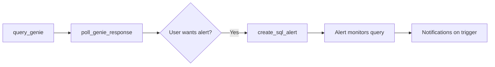

# feat: Add MCP tool to create SQL alerts from Genie query results

## Overview

Add a new MCP tool `create_sql_alert` that creates Databricks SQL alerts based on SQL queries generated by the Genie tools. This enables an end-to-end workflow where users can ask natural language questions, get SQL results, and set up automated monitoring alerts.

## Problem Statement / Motivation

Currently, the MCP server provides Genie tools for querying data via natural language:
1. `list_genie_spaces` - Discover available spaces
2. `query_genie` - Submit NL queries
3. `poll_genie_response` - Get SQL results

However, there's no way to turn these insights into automated monitoring. Users must manually go to Databricks SQL UI to create alerts. This breaks the conversational flow and requires context switching.

**User Story:** "As a user, after asking Genie 'show me orders with revenue over $10k', I want to set up an alert to notify me whenever new orders meet that criteria."

## Proposed Solution

Add a `create_sql_alert` tool that:
1. Accepts SQL query (from `poll_genie_response` output)
2. Creates a saved query in Databricks SQL
3. Creates an alert with specified condition (column, operator, threshold)
4. Returns alert ID and URL for user reference

### Workflow



## Technical Approach

### Tool Signature

```python
@mcp_server.tool
def create_sql_alert(
    alert_name: str,
    sql_query: str,
    warehouse_id: str,
    column_name: str,
    operator: str,
    threshold_value: float,
    description: Optional[str] = None
) -> dict:
    """
    Create a Databricks SQL alert from a SQL query.

    Use this tool after poll_genie_response to set up automated monitoring
    on query results. The alert will trigger when the specified column
    meets the threshold condition.

    Args:
        alert_name: Human-readable name (use snake_case, e.g., "high_revenue_orders")
        sql_query: SQL query to monitor (from poll_genie_response.query_result.sql)
        warehouse_id: SQL warehouse ID to execute the query
        column_name: Column in query result to monitor
        operator: Comparison operator (GREATER_THAN, LESS_THAN, EQUAL,
                  GREATER_THAN_OR_EQUAL, LESS_THAN_OR_EQUAL, NOT_EQUAL, IS_NULL)
        threshold_value: Numeric threshold for triggering
        description: Optional description of alert purpose

    Returns:
        dict: Contains alert_id, alert_name, query_id, alert_url on success
              or error, message on failure

    Example response:
        {
            "success": True,
            "alert_id": "abc-123",
            "alert_name": "high_revenue_orders",
            "query_id": "query-456",
            "alert_url": "https://workspace.cloud.databricks.com/sql/alerts/abc-123",
            "message": "Alert created successfully"
        }

    Next steps:
        View and manage the alert in Databricks SQL UI using the alert_url.
        The alert will check the condition based on its configured schedule.
    """
```

### Implementation Details

**Location:** `server/tools.py` (inside `load_tools()` function)

**Authentication:** Use `_get_workspace_client()` (M2M OAuth) for consistency with existing Genie tools.

**Dependencies:**
- `databricks.sdk.service.sql` - For `CreateQueryRequestQuery`, `CreateAlertRequestAlert`, `AlertCondition`, etc.

### Implementation Steps

1. **Input Validation**
   - Validate `alert_name` is non-empty
   - Validate `sql_query` is non-empty and is a SELECT statement
   - Validate `operator` is one of the supported values
   - Validate `threshold_value` is numeric

2. **Create Saved Query**
   ```python
   query = w.queries.create(
       query=sql.CreateQueryRequestQuery(
           display_name=f"alert_query_{alert_name}_{timestamp}",
           warehouse_id=warehouse_id,
           description=description or f"Query for alert: {alert_name}",
           query_text=sql_query,
       )
   )
   ```

3. **Create Alert**
   ```python
   alert = w.alerts.create(
       alert=sql.CreateAlertRequestAlert(
           display_name=alert_name,
           query_id=query.id,
           condition=sql.AlertCondition(
               operand=sql.AlertConditionOperand(
                   column=sql.AlertOperandColumn(name=column_name)
               ),
               op=operator_enum,
               threshold=sql.AlertConditionThreshold(
                   value=sql.AlertOperandValue(double_value=threshold_value)
               ),
               empty_result_state=sql.AlertState.OK,
           )
       ),
       auto_resolve_display_name=True
   )
   ```

4. **Return Response**
   ```python
   return {
       "success": True,
       "alert_id": alert.id,
       "alert_name": alert.display_name,
       "query_id": query.id,
       "alert_url": f"{WORKSPACE_URL}/sql/alerts/{alert.id}",
       "message": f"Alert '{alert_name}' created successfully"
   }
   ```

### Error Handling

Follow existing patterns in `server/tools.py:829-913`:

| Error Case | Error Code | Recovery Suggestion |
|------------|------------|---------------------|
| Empty alert_name | `INVALID_INPUT` | Provide a non-empty alert name |
| Invalid operator | `INVALID_OPERATOR` | Use one of: GREATER_THAN, LESS_THAN, etc. |
| Warehouse not found | `WAREHOUSE_NOT_FOUND` | Check warehouse_id or list available warehouses |
| Permission denied | `PERMISSION_DENIED` | Request SQL alert creation permissions |
| Query creation failed | `QUERY_CREATION_FAILED` | Check SQL syntax and table permissions |
| Alert creation failed | `ALERT_CREATION_FAILED` | Check column name exists in query result |

### Rollback Strategy

If alert creation fails after query is created:
```python
try:
    alert = w.alerts.create(...)
except Exception as e:
    # Rollback: delete the saved query
    try:
        w.queries.delete(id=query.id)
    except:
        pass  # Best effort cleanup
    raise e
```

## Acceptance Criteria

### Functional Requirements
- [ ] Tool accepts all required parameters (alert_name, sql_query, warehouse_id, column_name, operator, threshold_value)
- [ ] Tool creates a saved query with the provided SQL
- [ ] Tool creates an alert linked to the saved query
- [ ] Tool returns alert_id and alert_url on success
- [ ] Tool returns structured error dict on failure
- [ ] Tool cleans up saved query if alert creation fails

### Non-Functional Requirements
- [ ] Follows existing tool patterns in `server/tools.py`
- [ ] Comprehensive docstring with Args, Returns, Example response
- [ ] Input validation before API calls
- [ ] Error messages include recovery suggestions

### Testing Requirements
- [ ] Integration test for happy path
- [ ] Test for invalid operator handling
- [ ] Test for warehouse not found
- [ ] Test for permission denied
- [ ] Manual test with real Genie query result

## File Changes

| File | Change |
|------|--------|
| `server/tools.py` | Add `create_sql_alert` function inside `load_tools()` |
| `tests/test_integration_server.py` | Add test case for `create_sql_alert` tool |
| `CLAUDE.md` | Update Genie Tools Usage Guide with alert creation flow |

## Code Examples

### Complete Tool Implementation

```python
# server/tools.py - Add inside load_tools()

@mcp_server.tool
def create_sql_alert(
    alert_name: str,
    sql_query: str,
    warehouse_id: str,
    column_name: str,
    operator: str,
    threshold_value: float,
    description: Optional[str] = None
) -> dict:
    """
    Create a Databricks SQL alert from a SQL query.

    Use this tool after poll_genie_response to set up automated monitoring
    on query results. The alert will trigger when the specified column
    meets the threshold condition.

    Use this tool when:
    - User wants to monitor query results automatically
    - User asks to "alert me when..." or "notify me if..."
    - User wants to set up automated monitoring on Genie insights

    Args:
        alert_name: Human-readable name (use snake_case, e.g., "high_revenue_orders")
        sql_query: SQL query to monitor (from poll_genie_response.query_result.sql)
        warehouse_id: SQL warehouse ID to execute the query
        column_name: Column in query result to monitor
        operator: Comparison operator - one of:
            - GREATER_THAN: Trigger when value > threshold
            - GREATER_THAN_OR_EQUAL: Trigger when value >= threshold
            - LESS_THAN: Trigger when value < threshold
            - LESS_THAN_OR_EQUAL: Trigger when value <= threshold
            - EQUAL: Trigger when value == threshold
            - NOT_EQUAL: Trigger when value != threshold
            - IS_NULL: Trigger when value is NULL
        threshold_value: Numeric threshold for triggering
        description: Optional description of alert purpose

    Returns:
        dict: Contains alert_id, alert_name, query_id, alert_url on success
              or error, message on failure

    Example response:
        {
            "success": True,
            "alert_id": "abc-123",
            "alert_name": "high_revenue_orders",
            "query_id": "query-456",
            "alert_url": "https://workspace.cloud.databricks.com/sql/alerts/abc-123",
            "message": "Alert created successfully"
        }

    Next steps:
        View and manage the alert in Databricks SQL UI using the alert_url.
        Configure notification recipients in the UI if needed.
    """
    from databricks.sdk.service import sql as sql_service
    import time

    # Operator mapping
    operator_map = {
        "GREATER_THAN": sql_service.AlertOperator.GREATER_THAN,
        "GREATER_THAN_OR_EQUAL": sql_service.AlertOperator.GREATER_THAN_OR_EQUAL,
        "LESS_THAN": sql_service.AlertOperator.LESS_THAN,
        "LESS_THAN_OR_EQUAL": sql_service.AlertOperator.LESS_THAN_OR_EQUAL,
        "EQUAL": sql_service.AlertOperator.EQUAL,
        "NOT_EQUAL": sql_service.AlertOperator.NOT_EQUAL,
        "IS_NULL": sql_service.AlertOperator.IS_NULL,
    }

    # Input validation
    if not alert_name or not alert_name.strip():
        return {
            "error": "INVALID_INPUT",
            "message": "alert_name is required"
        }

    if not sql_query or not sql_query.strip():
        return {
            "error": "INVALID_INPUT",
            "message": "sql_query is required"
        }

    if not warehouse_id or not warehouse_id.strip():
        return {
            "error": "INVALID_INPUT",
            "message": "warehouse_id is required"
        }

    if not column_name or not column_name.strip():
        return {
            "error": "INVALID_INPUT",
            "message": "column_name is required"
        }

    operator_upper = operator.upper().strip()
    if operator_upper not in operator_map:
        return {
            "error": "INVALID_OPERATOR",
            "message": f"operator must be one of: {', '.join(operator_map.keys())}",
            "provided": operator
        }

    # Validate SQL is SELECT statement (basic check)
    sql_upper = sql_query.strip().upper()
    if not sql_upper.startswith("SELECT"):
        return {
            "error": "INVALID_INPUT",
            "message": "sql_query must be a SELECT statement"
        }

    query = None
    try:
        w = _get_workspace_client()

        # Step 1: Create the saved query
        query_name = f"alert_query_{alert_name.strip()}_{int(time.time())}"
        query = w.queries.create(
            query=sql_service.CreateQueryRequestQuery(
                display_name=query_name,
                warehouse_id=warehouse_id.strip(),
                description=description or f"Query for alert: {alert_name}",
                query_text=sql_query.strip(),
            )
        )

        # Step 2: Create the alert
        alert = w.alerts.create(
            alert=sql_service.CreateAlertRequestAlert(
                display_name=alert_name.strip(),
                query_id=query.id,
                condition=sql_service.AlertCondition(
                    operand=sql_service.AlertConditionOperand(
                        column=sql_service.AlertOperandColumn(name=column_name.strip())
                    ),
                    op=operator_map[operator_upper],
                    threshold=sql_service.AlertConditionThreshold(
                        value=sql_service.AlertOperandValue(double_value=float(threshold_value))
                    ),
                    empty_result_state=sql_service.AlertState.OK,
                ),
                notify_on_ok=False,
            ),
            auto_resolve_display_name=True
        )

        return {
            "success": True,
            "alert_id": alert.id,
            "alert_name": alert.display_name,
            "query_id": query.id,
            "query_name": query_name,
            "alert_url": f"{WORKSPACE_URL}/sql/alerts/{alert.id}",
            "message": f"Alert '{alert_name}' created successfully"
        }

    except Exception as e:
        error_str = str(e)

        # Rollback: delete saved query if it was created
        if query is not None:
            try:
                w.queries.delete(id=query.id)
            except:
                pass  # Best effort cleanup

        if "RESOURCE_NOT_FOUND" in error_str or "warehouse" in error_str.lower():
            return {
                "error": "WAREHOUSE_NOT_FOUND",
                "message": f"Warehouse '{warehouse_id}' not found or not accessible",
                "warehouse_id": warehouse_id
            }
        elif "PERMISSION_DENIED" in error_str:
            return {
                "error": "PERMISSION_DENIED",
                "message": "Insufficient permissions to create alerts",
                "details": error_str
            }
        elif "column" in error_str.lower():
            return {
                "error": "COLUMN_NOT_FOUND",
                "message": f"Column '{column_name}' not found in query result",
                "column_name": column_name
            }
        else:
            return {
                "error": "ALERT_CREATION_FAILED",
                "message": str(e),
                "alert_name": alert_name
            }
```

### Usage Example (Agent Flow)

```python
# Step 1: Get SQL from Genie
genie_result = poll_genie_response(
    space_id="01f0d08866f11370b6735facce14e3ff",
    conversation_id="conv-123",
    message_id="msg-456"
)
# Returns: {"query_result": {"sql": "SELECT revenue, customer_id FROM orders WHERE revenue > 10000"}}

# Step 2: Create alert on the result
alert_result = create_sql_alert(
    alert_name="high_revenue_orders",
    sql_query=genie_result["query_result"]["sql"],
    warehouse_id="abc123def456",
    column_name="revenue",
    operator="GREATER_THAN",
    threshold_value=10000,
    description="Alert when high-revenue orders are detected"
)
# Returns: {"success": True, "alert_id": "alert-789", "alert_url": "..."}
```

## Dependencies & Risks

### Dependencies
- Databricks SDK `databricks.sdk.service.sql` module
- M2M OAuth credentials configured (`DATABRICKS_CLIENT_ID`, `DATABRICKS_CLIENT_SECRET`)
- SQL warehouse access

### Risks
| Risk | Mitigation |
|------|------------|
| User doesn't know warehouse_id | Future: Add `list_warehouses` helper tool |
| Column name doesn't exist | Tool will fail at alert creation; error message guides user |
| SQL query is slow/expensive | Document that alert runs periodically; user responsibility |
| Alert quota limits | Let Databricks API handle limits; pass error through |

## Future Considerations

### V2 Enhancements
- Add `recipients` parameter for email notifications
- Add `schedule_cron` parameter for custom schedules
- Add `list_sql_warehouses` tool to help users find warehouse IDs
- Add `update_sql_alert` tool for modifying existing alerts
- Support string/date threshold types for non-numeric columns

### Not in Scope
- Complex multi-condition alerts (AND/OR logic)
- Notification destination management (Slack, PagerDuty)
- Alert deletion or lifecycle management

## References

### Internal References
- Tool patterns: `server/tools.py:690-913` (Genie tools)
- Error handling: `server/tools.py:829-853` (input validation)
- Authentication: `server/tools.py:232-251` (`_get_workspace_client`)

### External References
- [Databricks SDK Alerts API](https://databricks-sdk-py.readthedocs.io/en/latest/workspace/sql/alerts.html)
- [Databricks SQL Alerts Documentation](https://docs.databricks.com/aws/en/sql/user/alerts/)
- [AlertOperator Enum](https://databricks-sdk-py.readthedocs.io/en/latest/dbdataclasses/sql.html#databricks.sdk.service.sql.AlertOperator)

---

**Plan created:** 2026-01-06
